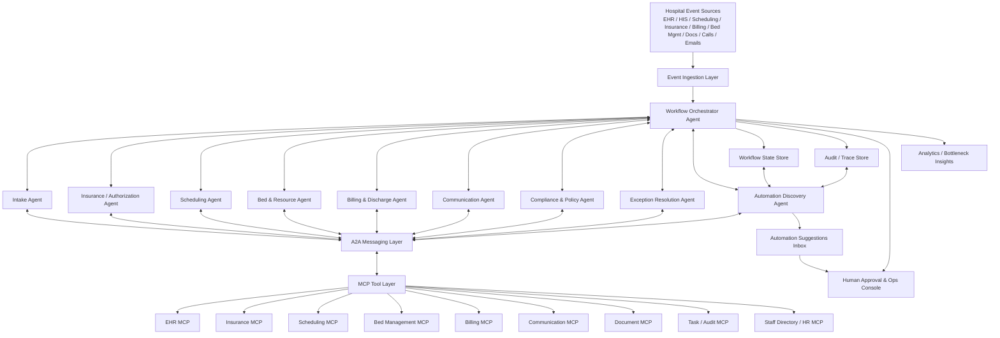
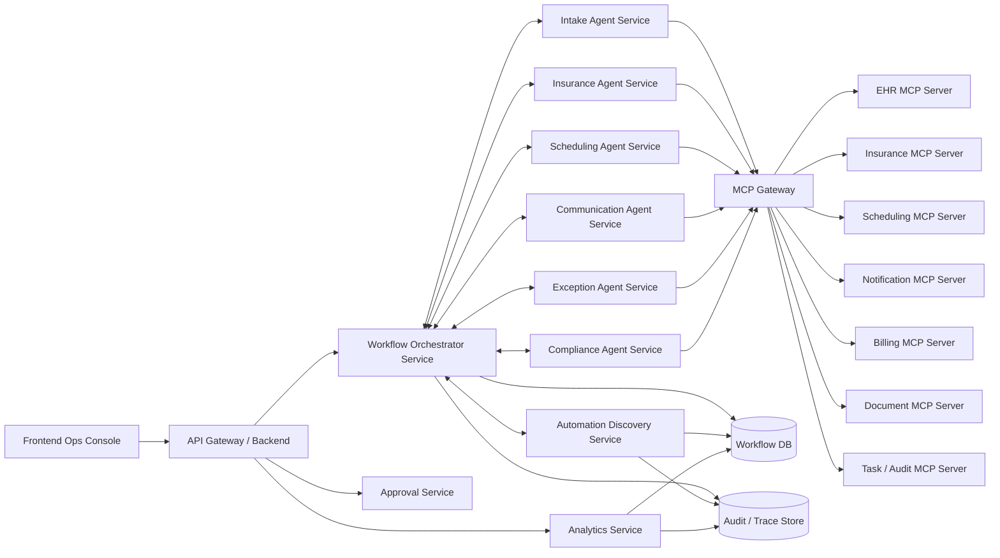

# Hospital Admin Workflow Optimizer
## Architecture Document

## 1. Overview

The **Hospital Admin Workflow Optimizer** is an **agentic workflow orchestration layer** built on top of existing hospital systems such as EHR/HIS, scheduling, insurance, billing, bed management, communication systems, and document systems.

It does **not replace** these systems. It sits above them and coordinates workflows that currently require repeated manual handoffs across teams.

Its core purpose is to reduce administrative delay, repetitive work, and cross-system coordination failure in workflows such as:

- patient intake readiness
- insurance eligibility and pre-authorization
- appointment scheduling and rescheduling
- discharge coordination
- bed and resource allocation
- missing document follow-up
- escalation of blocked administrative workflows

The system uses:

- **A2A (Agent-to-Agent)** for communication between specialized agents
- **MCP (Model Context Protocol)** for access to hospital systems and tools
- **workflow state management** for persistence and auditability
- **human approval gates** for sensitive actions
- an **automation discovery layer** that detects repetitive manual workflows and suggests automations

---

## 2. Problem Statement

Hospitals already have software platforms, but admin workflows are still fragmented.

A typical workflow often spans multiple disconnected systems and staff roles:

- front desk captures patient details
- insurance team checks coverage in a separate portal
- scheduling team coordinates slots
- bed team checks capacity
- billing waits for closure conditions
- discharge depends on multiple approvals
- communication with patient/family happens manually

This creates the following problems:

- repeated manual handoffs
- no end-to-end workflow ownership
- delays caused by missing documents or approvals
- repeated follow-ups by humans
- poor visibility into bottlenecks
- inconsistent escalation behavior
- high operational load on staff for low-value coordination work

The optimizer addresses these by turning admin work into structured, stateful, multi-agent workflows.

---

## 3. Architectural Goals

The system should:

1. orchestrate hospital admin workflows dynamically rather than through brittle hardcoded scripts
2. connect safely to existing hospital systems using MCP adapters
3. let specialized agents collaborate through A2A messaging
4. maintain persistent workflow state and audit trails
5. allow human review for high-risk or policy-sensitive actions
6. identify repeated manual patterns and recommend new automations
7. remain explainable, observable, and compliant

---

## 4. High-Level Architecture Diagram

---

## 5. Layered Architecture

### 5.1 Event Source Layer
This layer emits triggers that start or update workflow instances.

Typical events:

- appointment booked
- patient registered
- discharge initiated
- discharge medically ready
- insurance pre-auth pending
- bed request raised
- missing document detected
- claim rejected
- no-show risk trigger

These events may come from:

- EHR / HIS
- scheduling systems
- insurance systems
- billing systems
- bed management systems
- lab or radiology systems
- CRM / call center systems
- email / SMS / WhatsApp integrations

### 5.2 Event Ingestion Layer
This layer normalizes external events and feeds them into the orchestration engine.

Responsibilities:

- receive system events or webhook payloads
- validate and normalize event schema
- enrich with workflow context identifiers
- deduplicate repeated events
- push valid events into workflow orchestration queue

### 5.3 Workflow Orchestrator Layer
This is the central control plane for workflow execution.

Responsibilities:

- instantiate workflow instances
- identify workflow goal and current context
- decompose goal into subtasks
- choose which agents should participate
- maintain dependency graph across tasks
- manage retries, escalations, and approvals
- update workflow state continuously
- coordinate agent responses

This component should **not** directly own all business logic. It coordinates specialized agents rather than behaving like one giant all-knowing worker.

### 5.4 Agent Layer
Specialized agents perform specific categories of admin work.

#### Intake Agent
Handles:

- patient intake completeness checks
- required document validation
- demographic verification
- initiating downstream insurance readiness checks

#### Insurance / Authorization Agent
Handles:

- insurance eligibility checks
- pre-authorization submission
- monitoring authorization status
- rejection reason classification
- escalation of insurer delays

#### Scheduling Agent
Handles:

- appointment booking and rescheduling
- slot matching
- conflict checks
- schedule proposal generation
- slot blocking/unblocking based on readiness conditions

#### Bed & Resource Agent
Handles:

- bed availability checks
- reservation/release decisions
- ICU/general/ward mapping rules
- equipment and resource dependency checks

#### Billing & Discharge Agent
Handles:

- discharge readiness checklist
- pending billing item detection
- payment status verification
- discharge packet generation triggers
- coordination with pharmacy and final closure steps

#### Communication Agent
Handles:

- patient reminders
- document request messages
- family notifications
- internal reminders and escalations
- follow-up nudges

#### Compliance & Policy Agent
Handles:

- policy validation
- automation eligibility checks
- approval requirement decisions
- compliance constraints for sensitive actions

#### Exception Resolution Agent
Handles:

- blocked workflow handling
- contradictory system state resolution
- fallback path generation
- human escalation routing

#### Automation Discovery Agent
Handles:

- mining workflow traces
- identifying repetitive admin patterns
- generating automation candidates
- scoring automation risk and value

### 5.5 A2A Communication Layer
This layer supports structured communication between agents.

It is used for:

- delegation
- information requests
- dependency checks
- coordination of parallel subtasks
- escalation routing
- status propagation

Example:

- Intake Agent asks Insurance Agent whether eligibility can proceed with partial data
- Insurance Agent replies that ID proof is missing
- Communication Agent is instructed to request the document
- Scheduling Agent marks appointment as provisional
- Exception Agent starts a timed follow-up

### 5.6 MCP Tool Layer
All hospital systems are exposed through MCP adapters.

This avoids direct tight coupling between agents and source systems.

Examples of MCP servers and tools:

#### EHR MCP
- `get_patient_profile(patient_id)`
- `get_appointment_details(appointment_id)`
- `update_patient_demographics(...)`
- `get_discharge_summary_status(patient_id)`

#### Insurance MCP
- `check_insurance_eligibility(...)`
- `submit_preauth_request(...)`
- `get_preauth_status(...)`
- `fetch_claim_rejection_reason(...)`

#### Scheduling MCP
- `get_doctor_slots(...)`
- `book_slot(...)`
- `reschedule_slot(...)`
- `check_ot_availability(...)`

#### Bed Management MCP
- `get_bed_availability(...)`
- `reserve_bed(...)`
- `release_bed(...)`
- `get_icu_capacity(...)`

#### Billing MCP
- `get_pending_bill_items(...)`
- `generate_estimate(...)`
- `verify_payment_status(...)`
- `trigger_discharge_billing(...)`

#### Communication MCP
- `send_sms(...)`
- `send_email(...)`
- `send_whatsapp_message(...)`
- `create_call_task(...)`

#### Document MCP
- `fetch_uploaded_docs(...)`
- `verify_required_docs(...)`
- `request_missing_document(...)`
- `generate_forms(...)`

#### Task / Audit MCP
- `create_task(...)`
- `assign_task(...)`
- `mark_task_complete(...)`
- `write_audit_log(...)`

#### Staff Directory / HR MCP
- `get_staff_schedule(...)`
- `get_role_availability(...)`
- `find_backup_staff(...)`

### 5.7 Workflow State Layer
This layer stores persistent workflow context.

It should track:

- workflow instance ID
- patient / appointment / claim / bed request IDs
- current workflow stage
- pending tasks
- completed tasks
- dependencies
- agent decisions
- human approvals
- escalation state
- SLAs and deadlines
- final outcomes

Without a persistent workflow state store, the system becomes fragile and non-recoverable.

### 5.8 Audit and Trace Layer
This layer stores:

- agent actions
- tool calls
- human interventions
- decisions taken
- timestamps
- escalation reasons
- workflow transitions

This is required for:

- compliance
- explainability
- debugging
- optimization analysis
- automation discovery

### 5.9 Human Approval & Operations Console
This is the human-in-the-loop control surface.

Functions:

- approve or reject sensitive actions
- monitor live workflows
- view blocked cases
- inspect reasons behind recommendations
- manually intervene when needed
- accept or reject suggested automations

---

## 6. Exact Connectivity Model

The exact logical connectivity is:

1. hospital systems emit data/events
2. event ingestion normalizes them
3. workflow orchestrator opens or updates a workflow instance
4. orchestrator assigns tasks to specialized agents
5. agents communicate via A2A where dependencies exist
6. agents call MCP tools to read or update hospital systems
7. workflow state store is updated after every meaningful action
8. sensitive or ambiguous actions go through human approval
9. audit/trace store records the entire execution chain
10. automation discovery continuously analyzes traces for patterns

In compressed form:

**Systems -> Event Ingestion -> Orchestrator -> Agents -> A2A + MCP -> State Store / Audit -> Human Console -> Automation Discovery**

---

## 7. Detailed Example Workflow: Pre-Visit Intake and Insurance Readiness

This is the best first POC because it is operationally important and simpler than full discharge coordination.

### Workflow Goal
Ensure that a patient appointment is administratively ready before the visit date.

### Trigger
A new appointment is booked.

### End-to-End Flow

#### Step 1: Event arrives
- scheduling system emits `appointment_booked`
- event ingestion layer normalizes payload
- orchestrator creates workflow instance

#### Step 2: Orchestrator plans subtasks
It breaks the workflow into:

- patient intake completeness check
- required document verification
- insurance eligibility check
- pre-auth requirement check
- communication for missing items
- rescheduling proposal if required

#### Step 3: Intake Agent executes checks
Using EHR MCP and Document MCP:

- fetch patient profile
- verify demographic completeness
- check whether required referral / ID / insurance card documents exist

If something is missing, Intake Agent updates workflow state.

#### Step 4: Insurance Agent validates readiness
Using Insurance MCP:

- check eligibility
- determine whether pre-auth is required
- submit pre-auth if needed
- classify risk of delay

#### Step 5: A2A coordination happens
Examples:

- Intake Agent informs Insurance Agent that insurance card is missing
- Insurance Agent responds that eligibility cannot be completed
- Orchestrator delegates Communication Agent to request the missing document
- Scheduling Agent is told not to finalize or confirm readiness yet

#### Step 6: Communication Agent acts
Using Communication MCP:

- send patient a reminder for missing referral / insurance card / ID proof
- create follow-up task for staff if not received within defined SLA

#### Step 7: Scheduling Agent evaluates next step
If pre-auth delay risk is high:

- fetch alternate available slots
- generate rescheduling options
- hold current slot if policy allows

#### Step 8: Compliance Agent evaluates automation risk
For some actions, automatic execution is fine.
For others, human approval may be required.

Examples:

- sending reminder SMS: auto-approved
- changing a specialty appointment slot: may require human review

#### Step 9: Human console used if needed
Staff can:

- approve rescheduling recommendation
- override if necessary
- contact patient manually in edge cases

#### Step 10: Workflow completion
Possible end states:

- ready for visit
- pending patient action
- pending insurer approval
- reschedule recommended
- escalated to human coordinator

---

## 8. Detailed Example Workflow: Discharge Coordination

### Workflow Goal
Reduce administrative discharge delay after patient becomes medically ready.

### Trigger
EHR emits `patient_medically_ready_for_discharge`.

### End-to-End Flow

#### Step 1: Orchestrator creates discharge workflow instance
Subtasks include:

- check discharge summary status
- verify billing closure
- verify pharmacy readiness
- verify insurance final clearance
- notify family/patient
- estimate discharge completion time

#### Step 2: Billing & Discharge Agent calls MCP tools
- fetch pending bill items
- verify payment status
- check discharge summary completion
- check final pharmacy meds readiness

#### Step 3: Insurance Agent verifies constraints
- get final authorization or clearance status
- classify whether insurer is blocking discharge

#### Step 4: Communication Agent sends operational updates
- notify family of likely discharge window
- request pending payment if required
- notify transport staff if applicable

#### Step 5: Exception Agent handles blockers
Example blocker:

- discharge summary unsigned for 45 minutes

Possible actions:

- escalate to resident
- escalate to assistant if no response
- notify admin coordinator
- create SLA breach warning

#### Step 6: Human review for policy-sensitive alternatives
If alternate signature or process override is needed, human approval is required.

#### Step 7: Completion
Once all conditions are met:

- workflow closes
- audit trail is stored
- bottleneck causes are saved for analysis

---

## 9. How the System Stays Non-Hardcoded

A fake workflow system uses rigid if-else chains.

Example of brittle logic:

- if appointment booked, do intake check
- then do insurance check
- then message patient

That is just scripting.

A stronger architecture behaves differently:

- it receives a goal and current case context
- it knows available agents and tools
- it knows policies, allowed actions, and dependencies
- it plans which tasks matter for that particular case
- it changes the path based on context

Examples:

- some visits do not need insurance authorization
- some patients have complete documents already
- some slots can be held provisionally
- some cases need human approval for reschedule
- some workflows are blocked by bed availability instead of billing

So the correct design is:

**dynamic agent planning within bounded operational rules**

Not wild autonomy and not brittle hardcoding.

---

## 10. Novelty Features

The strongest novelty is not just “many agents”. That alone is not enough.

### 10.1 Workflow Bottleneck Prediction
The system predicts where a workflow will likely fail before it fails.

Examples:

- insurer X typically delays pre-auth beyond SLA
- ward Y often delays bed release at noon
- doctor team Z frequently signs discharge documents late
- procedure P commonly lacks one consent form

The orchestrator can act proactively instead of reactively.

### 10.2 Cross-Workflow Dependency Intelligence
The system does not only optimize one task in isolation.
It understands ripple effects.

Examples:

- delayed discharge causes bed shortage
- bed shortage causes ER admission delays
- delayed pre-auth causes OT underutilization
- one missed document causes an entire specialty schedule reshuffle

This lets the system prioritize based on system-wide impact.

### 10.3 SLA-Aware Dynamic Prioritization
Tasks are prioritized by impact, not simply by arrival order.

Priority factors may include:

- patient impact
- downstream operational impact
- revenue impact
- SLA breach risk
- staff availability
- resource utilization effect

### 10.4 Explainable Action Recommendations
Every recommendation should show:

- what was detected
- which systems were checked
- why this action is proposed
- whether policy allows auto-execution
- whether approval is required

This is critical in hospital environments.

### 10.5 Automation Discovery Layer
This is the strongest add-on novelty.

The system watches repeated manual admin patterns and suggests new automations.

That turns the platform from a configured workflow engine into a self-improving operational optimizer.

---

## 11. Automation Discovery Add-On

### 11.1 Purpose
The system should not only execute workflows that were manually designed earlier.
It should also detect repetitive human behavior and suggest that those behaviors be automated.

### 11.2 Input Data for Detection
The discovery layer observes:

- workflow traces
- repeated human task sequences
- repeated approvals
- repeated escalations
- repeated reminder messages
- repeated manual overrides
- repeated cross-system lookup patterns
- time spent in repeated coordination steps

### 11.3 Detection Pipeline

#### A. Activity Capture Layer
Capture structured events such as:

- who took action
- which workflow type was active
- which agents were involved
- which MCP tools were called
- what human action followed
- whether the decision was repeated often
- whether the workflow had stable trigger conditions

#### B. Pattern Mining Layer
Detect patterns like:

- repeated sequence of actions
- repeated conditional branches
- same decision logic applied manually many times
- same escalation flow after the same trigger
- same reminder sent under the same conditions

#### C. Automation Candidate Generator
Convert detected patterns into suggested automation templates.

Example suggestion:

> For cardiology appointments missing referral documents, staff repeatedly send a reminder, mark booking as pending, and create a 24-hour follow-up. Suggest automating this workflow.

#### D. Risk and Approval Evaluator
Before recommending automation, the system should score:

- determinism of the pattern
- action risk
- compliance sensitivity
- override frequency
- data reliability
- potential patient impact

#### E. Automation Deployment Layer
If approved:

- create a new workflow template or rule
- bind it to relevant agents and tools
- define approval gates if required
- activate it for future matching cases

### 11.4 Example Automation Suggestions in This Use Case

#### Example 1: Missing insurance card follow-up
Detected pattern:

- appointment booked
- insurance card missing
- staff sends reminder
- staff marks appointment as pending
- follow-up task set for 12 hours

Suggested automation:

- Intake Agent detects missing document
- Communication Agent sends reminder automatically
- Scheduling Agent marks slot provisional
- Task MCP creates timed follow-up

#### Example 2: Repeated pre-auth workflow for payer-procedure pair
Detected pattern:

- insurer Y + procedure X always triggers same pre-auth sequence
- staff repeatedly does same 4-step flow

Suggested automation:

- auto-run pre-auth workflow template for that insurer-procedure pair
- escalate only if status remains unchanged beyond SLA

#### Example 3: Delayed discharge signature escalation
Detected pattern:

- if discharge summary unsigned for more than 30 minutes
- nurse escalates to resident
- after 15 more minutes, escalates to assistant/coordinator

Suggested automation:

- create timed escalation path handled by Exception Agent and Communication Agent

#### Example 4: No-show risk confirmation workflow
Detected pattern:

- first-time patient + no document upload + no response 24h before appointment
- staff manually sends reminders and calls patient

Suggested automation:

- automatically trigger reconfirmation workflow
- create manual call task only if digital communication fails

---

## 12. Suggested POC Scope

Do not build the full hospital universe first. That is a mistake.

### Recommended POC
**Pre-Visit Intake + Insurance Readiness Workflow**

Why this is the right POC:

- easier to simulate and demo
- lower clinical sensitivity than some discharge operations
- clearly measurable operational value
- uses multiple agents and MCP tools naturally
- easy to add automation discovery examples

### Minimum Agents for POC
- Workflow Orchestrator Agent
- Intake Agent
- Insurance Agent
- Scheduling Agent
- Communication Agent
- optional: Compliance Agent

### Minimum MCPs for POC
- Patient / EHR MCP
- Insurance MCP
- Scheduling MCP
- Notification MCP
- Task / Audit MCP
- optional: Document MCP

### POC Demo Narrative
1. appointment booked
2. system checks document completeness
3. insurance eligibility checked
4. pre-auth need identified
5. patient automatically reminded for missing item
6. scheduling put on hold or alternate slot suggested
7. human approves edge-case reschedule
8. automation discovery shows a detected repeated pattern and proposes new automation

That is enough to demonstrate real agentic behavior without overcomplicating the build.

---

## 13. Suggested Internal Service Architecture

---

## 14. Security, Compliance, and Guardrails

This kind of system must not be designed as unrestricted AI autonomy.

Required guardrails:

- role-based access control for agent actions
- MCP tools limited to allowed actions per agent
- approval requirements for sensitive operations
- traceability for every tool call and decision
- policy engine for automation boundaries
- PHI-safe logging and redaction strategy where needed
- retry and fallback logic for external system failures
- deterministic fail-safe behavior for blocked tasks

Low-risk actions may be fully automatic:

- sending reminder SMS
- creating follow-up tasks
- status polling
- internal notifications

Higher-risk actions should require approval:

- rescheduling critical appointments
- overriding discharge blockers
- changing financially sensitive workflow states
- using alternate policy exceptions

---

## 15. Why This Is Stronger Than Existing Basic Workflow Automation

Normal hospital workflow automation usually does one of these:

- static BPM-style process execution
- rule-based notifications
- task ticketing
- silo-level workflow optimization only

This architecture is stronger because it adds:

- dynamic multi-agent coordination
- cross-system tool access through MCP
- context-sensitive planning instead of fixed branching only
- exception reasoning
- system-wide prioritization
- automation discovery from repeated manual behavior

That last point is the biggest differentiator.

---

## 16. Final Summary

The Hospital Admin Workflow Optimizer should be built as a **stateful, multi-agent orchestration platform** that sits on top of existing hospital systems.

Its architecture should include:

- event ingestion from hospital systems
- a central workflow orchestrator
- specialized agents for intake, insurance, scheduling, discharge, communication, compliance, and exception handling
- A2A communication between agents
- MCP adapters for all hospital systems and operational tools
- persistent workflow state and audit logging
- human approval controls
- an automation discovery layer that detects repeated manual patterns and recommends new automations

The best initial POC is **Pre-Visit Intake + Insurance Readiness**, because it is realistic, valuable, and demonstrable.

The strongest novelty is **not** merely using agents. The strongest novelty is adding a **workflow discovery and automation suggestion layer** that continuously learns repetitive administrative patterns and proposes new automations for approval.

